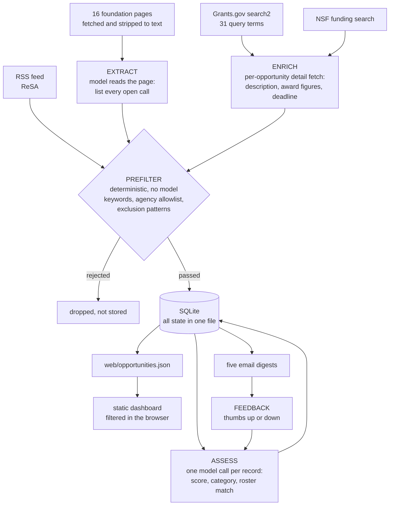
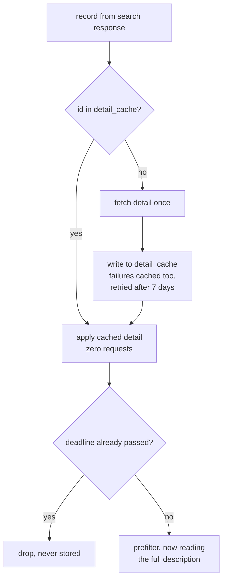
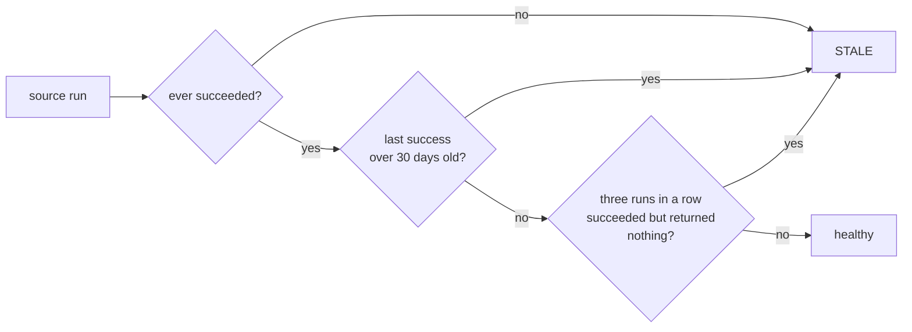

# Grant Sift

Funding signal for a research software group. It reads Grants.gov, NSF, a fixed
list of foundation pages, and an RSS feed; scores each opportunity for RSE
relevance; matches it against your roster of past collaborators; and puts the
result in a static dashboard and a set of email digests.

The point is not to find the obvious cyberinfrastructure calls, everyone sees
those, which is why they are crowded. It is to find the domain solicitation with
a software or data-management requirement buried inside it, where a PI will need
a partner and does not yet know it.

## Setup

```bash
pip install -r requirements.txt

cp .env.example .env      # then fill in your Lumen project key
set -a; source .env; set +a
```

The gateway defaults to NCSA Lumen, an OpenAI-compatible proxy, so the only
required value is the key. `GRANT_SIFT_LLM_MODEL` defaults to `gemma-4-31b-it`.
Override `GRANT_SIFT_LLM_BASE_URL` for any other OpenAI-compatible gateway.

```bash
# Which models can this key actually reach?
curl -sS "https://lumen.ncsa.illinois.edu/v1/models" \
     -H "Authorization: Bearer $GRANT_SIFT_LLM_API_KEY"

python run.py daily
python -m http.server -d web 8080      # then open localhost:8080
```

Prefer a large-context model. Foundation-page extraction sends up to 60k
characters, and a small window truncates mid-page and silently drops the calls
near the bottom.

`config/roster.yaml` is the file that decides whether any of this is useful. It
ships with 49 real collaborations, but the `status` field on each one was
inferred from dates alone. Fix that first: `status` decides what reaches the
roster-match digest, and a wrongly-cold entry costs you a lead invisibly.

## Running it

```bash
python run.py daily                    # ingest, assess, export, digest, the cron job
python run.py status                   # what ran, what has gone stale
python run.py assess --limit 25        # classify a batch, to eyeball scores first
python run.py digest --feed closing-soon --send
python run.py feedback gg:349021 down "student training grant, not for us"
```

Cron:

```
0 6 * * *  cd /srv/grant-sift && ./venv/bin/python run.py daily >> run.log 2>&1
```

## How it works



Feedback closes the loop: cases where a human disagreed with the score are
injected into the next classification prompt as calibration examples. No
fine-tuning, no retraining, the prompt just accumulates your own hard cases.

Two properties worth preserving if you extend this:

**The model runs offline, at ingest, never in a request path.** The dashboard is
a static file. Nothing user-facing depends on the gateway being up.

**Nothing is discovered by following links.** Sources come from
`config/sources.yaml` and nowhere else. That is the difference between a tool
you maintain in an afternoon and a crawler you maintain forever.

## Why enrichment happens before the prefilter

Grants.gov's search endpoint returns only title, agency and dates. No
description, no award ceiling. Filtering on that means judging a thousand
records a day by their titles, which is exactly how a domain call with a
software requirement in its body text gets dropped invisibly.

So each opportunity gets one detail fetch, and it happens before the prefilter
runs. That only stays cheap because of a ledger: `detail_cache` remembers every
id already fetched, **including the ones the prefilter then rejected**. Those
are never stored as opportunities, so without the ledger they would be
re-fetched every morning.



Measured on 2026-09-04: filtering on titles alone stored 118 opportunities;
filtering on descriptions stored 597, every one with a synopsis and 373 with an
award figure. First pass costs about 1,150 detail fetches and roughly five
minutes. It commits every 50 fetches, so interrupting it keeps what it paid
for. Steady state is only genuinely new postings.

The expiry check runs twice, once on the search response and again after
enrichment, because the detail endpoint often supplies a deadline the search
response omitted and it may already have passed. Without the second check such
a record is stored, pruned, and re-fetched forever.

## Housekeeping

Every ingest ends by deleting calls whose deadline passed more than 30 days
ago, cascading to their assessments and sent-log rows. Two things it will not
touch:

- **Anything with feedback**, regardless of age. `few_shot_corrections` inner
  joins `opportunities`, so pruning a row that carries a thumbs up or down
  would silently drop that hard case from every future prompt. The calibration
  corpus is the one thing here that cannot be re-fetched.
- **Rolling calls with no deadline.** The tempting rule is to drop them once
  `last_seen` goes stale, but a broken source stops updating `last_seen` for
  its whole catalogue, so that rule would delete a source's entire list on the
  day it breaks.

`detail_cache` is also left alone by pruning, on purpose: it is the memory that
stops a pruned grant from being re-fetched tomorrow. The rows are tiny, the
requests are not.

## Foundation pages

Fetched, stripped to plain text, and handed to the model with "list every open
call on this page." No CSS selectors, so a site redesign changes the text
rather than breaking the adapter. A content hash is stored per URL and
unchanged pages skip the model call entirely, so steady-state cost is near
zero.

Because these pages carry no identifier of their own, records get a synthetic
id from `sha256(url + normalised program name)`. The normalisation is
deliberately aggressive so "EOSS Cycle 7" and "Essential Open Source Software
(Cycle 7)" resolve to the same record instead of re-alerting every week.

`indirect_cap` is extracted as a first-class field. Foundation caps of 10 to 15
percent are common, they sit well below a federal negotiated rate, and they
change whether a small award is worth taking, so it belongs in the digest, not
buried in prose.

A fetch that returns under 500 characters of stripped text raises instead of
extracting nothing. That catches the two ways a page can look fine and be
useless: a bot wall, and a client-rendered shell that ships JavaScript instead
of content. Both used to be recorded as a success with zero calls found.

## Nothing fetched is thrown away

Every record from every source is stored. Relevance and ranking are decided by
the model against `config/roster.yaml`, because that is the only judgement here
with any context, and a deterministic regex has none.

`config/prefilter.yaml` therefore annotates rather than filters. Its keywords,
agency allowlist and exclusion patterns all write a note into the `screen`
column saying what stood out, and nothing acts on it. That is queryable, so you
can ask what a filter would have cost you:

```sql
SELECT title, screen FROM opportunities WHERE screen LIKE '%matched exclusion%';
```

On the first run after this change that query showed the old SBIR pattern would
have discarded "NIEHS Worker Training Program's SBIR E-Learning", a
learning-technologies call, and one titled simply "Sociology". Measured: the
keyword gate had been cutting 1,041 records to 597, and assessing the
difference costs about 0.4 coins.

Closed calls are kept and marked "passed" rather than dropped, since a record
of what was once open is worth having. They queue behind live calls in
`assess`, so a `--limit` spends the budget where it can still be acted on.
Pruning is off unless `GRANT_SIFT_PRUNE_DAYS` is set.

## The web backend

`python run.py serve` adds two things a static page cannot do. It binds to
localhost by default, and that placement is the access control: there is no
login, and the dashboard exposes the roster, which names real collaborators and
how warm each relationship is.

```bash
python run.py serve                      # http://127.0.0.1:8080
python run.py serve --host 0.0.0.0 --port 8080   # only on a network you trust
```

**Feedback.** Thumbs up or down with one optional comment, written to the same
`feedback` table the classifier reads calibration examples from, so a judgement
made in the browser reaches the next prompt. Rate limited per client
(`GRANT_SIFT_FEEDBACK_PER_HOUR`, default 20) because those rows move the model,
not merely fill a log.

**Chat about one call.** NCSA Lumen sends no CORS headers, verified against the
live gateway, so a browser cannot call it directly and this endpoint forwards
the request. The viewer supplies their own key: it is held in `sessionStorage`
for that tab, sent per request, forwarded, and dropped. It is never stored,
never logged, and error text is scrubbed before it reaches the page.

Because that proxy would otherwise be an SSRF pivot, `base_url` must be https
and its host must be on an allowlist (`GRANT_SIFT_CHAT_ALLOWED_HOSTS`).
Verified refused: cloud metadata addresses, plain http, and arbitrary hosts.

The context sent is what the pipeline already holds for that call, its
synopsis, score, rationale and closest roster match. It never re-fetches the
solicitation, which would put a third-party site in a user-facing request path.

The dashboard still works with this server down. It reads the static
`opportunities.json`, and the thumbs and chat controls disable themselves when
`/api/health` does not answer.

## Two writers, one SQLite

SQLite is enough: one nightly batch and a handful of feedback rows, on one
host. It runs in WAL with a 30 second busy timeout so the web app can insert
while the nightly job writes.

The subtlety is transaction length, not the database. Both long loops make a
network call per record, so batching commits held SQLite's single writer lock
across those calls: at 3.3s per model call a batch of ten locked the database
for half a minute and the browser's feedback insert failed with "database is
locked". Both loops now commit per record, which keeps the lock to the duration
of an INSERT and costs nothing next to the call it follows.

Postgres would only be warranted by many concurrent writers, replication, or
running the app on a different host from the cron job over shared storage,
where SQLite locking is unsafe.

## Failure mode to watch

The risk is not a crash. It is a source that quietly stops yielding while the
pipeline reports success. There are three ways to be stale, and the third is
the one that hides:



That third branch exists because a fresh `last_success` with an empty list
looks perfectly healthy. The NSF adapter has been returning zero records while
reporting success; it is now flagged. Requiring three consecutive empty runs
keeps a genuinely quiet week from crying wolf, and a hard failure neither
inflates nor resets the streak because it is already visible as `last_error`.

Stale sources appear at the top of every digest, in a banner on the dashboard,
and in `run.py status`. Do not silence that banner.

Known: the Wellcome Trust page is unreachable by plain HTTP, every path answers
202 with an empty body. No URL fixes it. It is left in the config so it fails
loudly rather than disappearing quietly.

## The dashboard

A single static file reading `web/opportunities.json`. Filter chips for closing
soon, roster match, domain calls, CI programs and foundations; a search box
across titles, funders and people; and a roster-area picker built from the data
itself, with per-area counts, so it always reflects how the roster actually
matched. Each row's area tag toggles that filter too.

The number beside each title is the model's relevance score out of 100, not an
id. Award amounts, indirect caps, the closest roster match and its warmth all
render on the row.

## Cost

The gateway bills input and output separately, and there is no prompt caching
on Lumen: an identical prefix on a repeat call reports zero cached tokens. So
the roster, about 4,500 tokens, is paid for on every assess call. At 49 roster
entries that is roughly three quarters of each prompt.

Two settings dominate the bill, and both are in `.env`.

**Chain of thought is billed as output, and this task does not need it.**
`GRANT_SIFT_LLM_THINKING=off` is the default. On glm-5.2 it cut completion
tokens from about 1,350 to 180 per call with identical scores. It also fixes a
real failure: reasoning tokens count against `max_tokens`, so at the old budget
of 800 the model spent the entire allowance thinking, returned empty content,
and every record scored 0.

**Model choice is worth more than any prompt tuning.** Benchmarked on real
records from this pipeline on 2026-09-04, thinking off, cost shown for a full
597-record pass in Lumen coins:

| Model | Scores vs glm-5.2 | Coins | Notes |
| --- | --- | --- | --- |
| gemma-4-31b-it | identical | 0.57 | best value, no acknowledgment needed |
| deepseek-v4-flash | lower | 0.50 | missed a roster match |
| nemotron-3-super-120b-a12b | close | 0.63 | slightly generous |
| ornith-1.0-35b | much lower | 0.17 | missed a match, would push real calls under the cutoff |
| glm-5.2 | baseline | 4.10 | 7.6 with thinking on |

All five returned valid JSON. That was three opportunities in one subject area,
so treat it as a shortlist rather than a verdict: re-run it on a wider sample
before settling, and remember `ornith` scoring 25 where glm scored 50 would
have dropped that call below the export cutoff entirely.

If the roster grows past a few hundred entries, the cheaper structural fix is
to split assessment in two: score and categorise without the roster, then send
the roster only for records that clear the threshold. At current volumes that
complexity is not worth it.

One small VM or a scheduled CI job is the right size for this; anything more is
more infrastructure than the thing it runs.

## Tuning

The prefilter keyword list is deliberately loose. A false exclusion is
invisible and permanent; a false inclusion costs a fraction of a cent. Expect
to tighten it, not loosen it, and note that matching is plain substring, so
short tokens over-match: `api` also matches "rapid" and "therapies". Two-letter
tokens are avoided for that reason.

The query terms in `config/sources.yaml` are the opposite case. Each one costs
a separate API request and is capped at the endpoint's row limit, so a term
broad enough to exceed that cap is silently truncated. Keep those specific and
put the loose vocabulary in the prefilter.

## Deliberately not built

Award feeds and supplements, GitHub issue trackers, an API server, a vector
store, auth, a job queue, per-user saved filters, and headless-browser
rendering for the handful of pages that need it. Each is a plausible addition
that multiplies the maintenance surface for very little extra signal. Add one
only when its absence has actually cost you something.
