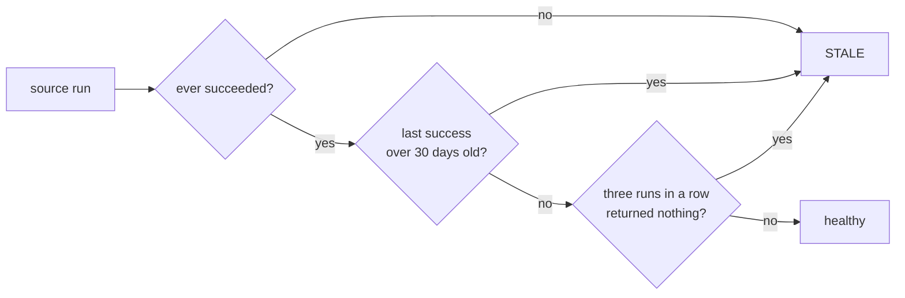

# Grant Sift

Funding signal for a research software group. It reads Grants.gov, NSF, sixteen
foundation pages and an RSS feed, scores each call for RSE relevance against a
roster of past collaborators, and puts the result in a dashboard and a set of
email digests.

The point is not to find the obvious cyberinfrastructure calls. Everyone sees
those, which is why they are crowded. It is to find the domain solicitation
with a software or data-management requirement buried inside it, where a PI
will need a partner and does not yet know it.

## Setup

```bash
pip install -r requirements.txt
cp .env.example .env          # then add your Lumen project key
cp config/roster.example.yaml config/roster.yaml            # collaborators and leads (gitignored)
cp config/ncsa_staff.example.yaml config/ncsa_staff.yaml   # optional: your staff's addresses
set -a; source .env; set +a

python run.py daily           # ingest, assess, export, digest
python run.py serve           # dashboard on http://127.0.0.1:8080
```

The gateway defaults to NCSA Lumen with `gemma-4-31b-it`, so the key is the
only required secret. Override `GRANT_SIFT_LLM_BASE_URL` for any other
OpenAI-compatible gateway.

`config/roster.yaml` and `config/ncsa_staff.yaml` are **not in git** — between
them they name real collaborators, their relationship status, and colleagues'
email addresses. `Projects/` is ignored too: it holds real proposal text and
must never reach a commit or a container image. Only the `.example.yaml` files
are tracked. Copy them, edit them, and keep them local (or mount them in Kubernetes
as ConfigMaps). If this repo was ever public or shared with the real files
committed, scrub history before relying on “gitignored now” — old commits still
contain them.

## Commands

```bash
python run.py daily [--limit N]     # the cron job, assesses N records (default 400)
python run.py ingest                # fetch, enrich, store
python run.py assess [--limit N]    # score anything unassessed, live calls first
python run.py assess --rematch      # clear no-match assessments first, after a roster addition
python run.py export                # write web/opportunities.json
python run.py status                # what ran, what has gone stale
python run.py serve [--host --port] # dashboard, feedback and chat
python run.py digest --feed closing-soon --send
python run.py feedback gg:349021 down "student training grant, not for us"
```

Subscribe to digests in the dashboard (**Personalize → Email digests**). Nightly
`daily` emails feeds when `GRANT_SIFT_SMTP_HOST` is set (campus relay:
[KB 47888](https://answers.uillinois.edu/illinois/47888)).

Nightly, via `scripts/daily.sh`, which loads `.env` and refuses to overlap
itself:

```
0 6 * * *  /srv/grant-sift/scripts/daily.sh >> /srv/grant-sift/run.log 2>&1
```

## How it works

```mermaid
flowchart TD
    SRC["config/sources.yaml<br/>reviewed baseline"] --> SL
    SRC2["source_entries<br/>added in the dashboard"] --> SL
    SL{{"source list<br/>merged at ingest, deduplicated on URL"}}
    SL --> A1
    SL --> A2
    SL --> A3
    SL --> A4
    A1["Grants.gov search2<br/>31 query terms"] --> E
    A2["NSF funding search"] --> E
    A3["RSS feed"] --> SC
    A4["foundation pages<br/>stripped to text"] --> X
    X["EXTRACT<br/>model lists the open calls"] --> SC
    E["ENRICH<br/>per-call detail fetch:<br/>description, award, deadline"] --> SC
    SC["SCREEN<br/>annotates only.<br/>Discards nothing"] --> S[("SQLite")]
    S --> AS["ASSESS<br/>one call per record:<br/>score, category, roster match"]
    R1["config/roster.yaml<br/>parties, projects optional"] --> AS
    R2["roster_entries<br/>added in the dashboard"] --> AS
    R3["config/ncsa_staff.yaml<br/>our addresses"] --> R1
    P["Projects/<br/>proposals, gitignored"] -.->|"build_roster.py"| R1
    AS --> S
    S --> J["web/opportunities.json"] --> D["dashboard"]
    R1 -.->|"who to email, and via whom"| J
    S --> G["five email digests"]
    D --> F["FEEDBACK<br/>what was wrong:<br/>score, category or match"]
    F --> S
    F -.->|"next run"| AS
```



Two properties worth preserving:

**The model runs offline, never in a request path.** The dashboard reads a
static file, so nothing user-facing depends on the gateway being up. The chat
proxy is the single exception, and it degrades to a disabled button.

**Nothing is discovered by following links.** Sources come from
`config/sources.yaml` and nowhere else. That is the difference between a tool
you maintain in an afternoon and a crawler you maintain forever.

## Nothing fetched is thrown away

Every record from every source is stored. Relevance is decided by the model
against the roster, because that is the only judgement here with any context.

`config/prefilter.yaml` therefore annotates rather than filters: its keywords,
allowlist and exclusion patterns write a note into `opportunities.screen` and
nothing acts on it. That is queryable, so you can ask what a filter would have
cost you:

```sql
SELECT title, screen FROM opportunities WHERE screen LIKE '%matched exclusion%';
```

The first run after this change showed the old SBIR pattern would have
discarded "NIEHS Worker Training Program's SBIR E-Learning" and one titled
simply "Sociology". The keyword gate had been cutting 1,041 records to 597.

Closed calls are kept and marked, and queue behind live ones in `assess`.
Pruning is off unless `GRANT_SIFT_PRUNE_DAYS` is set.

## Enrichment, and why it comes before the screen

Grants.gov's search endpoint returns only title, agency and dates. Filtering on
that means judging a thousand records a day by their titles.

So each opportunity gets one detail fetch first. That stays cheap because of a
ledger: `detail_cache` remembers every id already fetched, **including ones no
longer stored**, which would otherwise be re-fetched every morning. Measured:
title-only screening stored 118 records; description screening stored 597, all
with a synopsis and 373 with an award figure. The first pass is about 1,150
fetches and five minutes; steady state is only new postings.

Expiry is checked twice, on the search response and again after enrichment,
because the detail endpoint often supplies a deadline the search omitted that
has already passed.

## Feedback

A thumb alone conflates three different judgements, so the dashboard asks which
of them was wrong: the **score**, the **category**, or the **named
collaborator**. Three things then happen, on three timescales:

1. **Now, with no model call.** The verdict is authoritative, so a "not for us"
   drops the call out of the digests immediately. A reviewer outranks a score.
2. **Tonight.** The record's assessment is cleared and re-scored on the next
   run. Re-scoring it synchronously would be near-tautological: the correction
   is already in the prompt telling the model what to conclude.
3. **From then on.** The correction becomes a calibration example for *other*
   records, which is where the value actually is.

Example selection is deduplicated per opportunity, so one heavily rated call
cannot crowd out the rest; ordered by how far apart the model and reviewer were
rather than by recency; and includes a few confirmations, because agreement
used to be discarded, which made most clicks no-ops.

## Roster: one shape, projects optional

**`config/roster.yaml`** is the whole roster. One entry per **party** — a
person, a team, or an organisation — and `projects` is a list that may be
empty. That is the entire design.

A project is not a different kind of record, it is *evidence about* a party.
Grant Sift previously split these into two files, collaborations in one and
outreach contacts in the other, and the split was wrong: the same person
landed in both with contradictory status, so a co-author on a live ARPA-H
proposal was labelled *"we have never worked with them"* on the dashboard. One
entry per party makes that unrepresentable.

`status` is **derived** from `projects` and should normally be absent:

| projects | status | meaning |
| --- | --- | --- |
| none | `prospect` | a lead; you have not worked together |
| ongoing or recent | `warm` | you would call them tomorrow |
| all older than four years | `cold` | real past work, gone quiet |

Set it by hand only for the two things projects cannot express: `departed`
(their address has moved on) and `do-not-contact` (dropped at load time).
Because warmth is computed, nobody can assert a relationship the roster does
not evidence.

### Three kinds of match

The model sees the roster in three labelled sections, and records which one it
matched in `match_kind`:

| section | `kind` | `match_kind` | what the dashboard shows |
| --- | --- | --- | --- |
| PAST COLLABORATIONS | *(default)* | `collaboration` | them + via us |
| PROGRAMS WE RUN | `program` | `program` | via us only, badged *our own program* |
| KNOWN CONTACTS | *(default, no projects)* | `contact` | them + via us, badged *lead, not a past project* |

`kind: program` exists because roughly a third of the roster is not a partner
at all: Clowder, Ergo, Brown Dog, EarthCube, the NDS Labs Workbench. There is
nobody outside to introduce yourself to, and rendering them like partners
produced cards reading *"reach out to Luigi Marini, via us: Luigi Marini"* —
Luigi being NCSA staff and the platform's lead at once. A program card drops
the outward row entirely and shows only who here owns it.

**Our own staff never reach the model.** `notes` fields carry lines like
`internal contact Luigi Marini`, and the model duly reported him as the
collaborator to approach on 7 records before this was caught. `roster_block`
now strips the `internal contact …` clause and replaces any remaining staff
name with "our team" before the prompt is built, keeping the strategy prose
while removing the names. The rule the roster has always stated — our staff
are not parties — needed enforcing in code, not just in a comment.

### Where "them" and "via us" come from

Neither is stored. `assessments` holds no address of any kind — only
`match_name` and the other `match_*` fields. Contact details are joined on at
**export time**: `pipeline.contact_index()` builds a lookup from the roster
plus `ncsa_staff.yaml`, and `export_json` attaches the matching record to each
opportunity as `contact`, which is what the dashboard and the digests render.

The useful consequence: fixing an address in `config/roster.yaml` and re-running
`python run.py export` corrects every affected card at once. No re-assessment,
no model call.

The fragile part is the join key, which is the name the *model* returned. It
shortens: "Praveen Kumar" for the party `Praveen Kumar (PI, Civil and
Environmental Engineering, University of Illinois)`, and "Clowder Framework" —
a project title — for the Clowder community. An exact-match lookup dropped the
contact block on about one matched row in eight, silently, leaving a card with
a match and no way to act on it. `contact_index` therefore also registers
aliases for each party's leading personal name and each of its project titles,
added only where the key is free so a real party name always wins.

**`config/ncsa_staff.yaml`** stays separate on purpose. It is *us*, not
*them*: it maps the names in `ncsa_contact` to real addresses so the dashboard
shows both ends of an introduction. Put your own staff in the roster and the
matcher starts matching you to yourself. Take these addresses from your
directory rather than guessing netids — ours were not guessable.

### Browsing and adding, from the dashboard

The dashboard has two panels, **Roster** and **Sources**, both behind auth.

Each opens onto a searchable list rather than a form. That is deliberate: a
write-only form is one people fill in twice, because without seeing that
someone is already on the roster the reasonable thing to do is add them again.
The roster list shows status, unit, research areas, projects with years, the
collaborator's address and which of your staff already knows them. The sources
list shows every source with its health inline — last success, records kept,
and a `stale` flag — because a source that quietly stops yielding is the
failure this tool exists to catch.

| | endpoint |
| --- | --- |
| browse the whole roster | `GET /api/roster` |
| add a collaborator | `POST /api/roster` |
| stop using a dashboard entry | `POST /api/roster/{id}/retire` |
| browse sources with health | `GET /api/sources` |
| add a funder page or feed | `POST /api/sources` |
| stop reading an added source | `POST /api/sources/{id}/retire` |

**Everything added this way lands in the next cycle.** Sources are merged with
`config/sources.yaml` at ingest; roster entries are merged with
`config/roster.yaml` at assess. Neither file is ever written back to. A new
roster entry cannot retroactively match calls already scored — `assess
--rematch` is for that.

**Source deduplication** is on a normalised URL: scheme, `www.`, case, query
string and trailing slash are all stripped before comparing, and the check
covers the YAML baseline as well as previous additions. Two people will not
type the same URL for the same funder, and without this each spelling would
become its own source, fetched on its own cadence, each reporting itself
healthy. A duplicate *name* under a different URL is allowed but flagged in the
response, since one funder can legitimately have two pages worth reading.

Added URLs are fetched server-side by a background job, so `POST /api/sources`
validates the host: http(s) only, a public hostname required, and loopback,
private, link-local and cloud-metadata addresses refused. Without that, "add a
source" is an SSRF primitive.

**The `roster_entries` table** holds entries added in the dashboard. They are
**never** written back to the file, and default to `cold` since nothing typed
into a form has been reviewed. A new entry cannot retroactively match calls
already scored; `assess --rematch` clears assessments that matched nobody,
which is the cheap subset worth redoing.

### Building the roster

```bash
python scripts/build_contacts.py outreach.tsv config/contacts.yaml  # import a sheet
python scripts/crawl_areas.py resolve config/roster.yaml            # match names offline
python scripts/crawl_areas.py crawl   config/roster.yaml            # ~5s/person, resumable
python scripts/build_roster.py                                      # merge everything
```

`build_contacts.py` turns an outreach spreadsheet into roster entries. It only
auto-corrects a misspelled name when the email netid corroborates it, and
flags everything else in `review` rather than guessing. Its output is a
transient artefact: `build_roster.py` merges it in, and you can delete it.

`crawl_areas.py` fills `areas` from Illinois Experts, because a department
alone makes everyone in it look identical to the matcher. It honours the
site's `Crawl-Delay: 5`, caches under `.cache/`, takes a lock so two runs
cannot corrupt the file, and rejects any profile whose surname does not match
the person it looked up.

`build_roster.py` merges collaborations, imported contacts and projects read
out of `Projects/` into the single file, deduplicating on surname plus first
initial. It is idempotent.

Two tables in it carry knowledge no script can derive. `PROMOTIONS` holds
projects transcribed from `Projects/`. `SECOND_PASS` holds partners supplied by
someone who knows the work, keyed on a distinctive fragment of the party name,
and can `merge_into` an existing person, set a `partner`, mark a `kind`, or add
`ncsa_contact` names. Dedup deliberately refuses to surname-match a compound
name such as `M. S. Poole (PI, Communication), with D. Forsyth and M.
Hasegawa-Johnson` — its last token is a third person's surname, and keying on
it merged that collaboration into Mark Hasegawa-Johnson's record. Only the
*leading* name in such a string is safe to match on.

### Reading proposals out of `Projects/`

`Projects/` is gitignored and dockerignored: it holds real proposal text.
Evidence extracted from it goes in `PROMOTIONS` in `scripts/build_roster.py`,
transcribed by hand and **only** where the relationship is stated in prose.

This matters more than it sounds. NSF proposals embed a *Collaborators & Other
Affiliations* table listing everyone a PI has ever co-authored with — DeCODER's
runs to 311 pages — and matching roster names against proposal text suggested
63 collaborations that do not exist. A COA row means two people share a paper,
not that this group did work for them. Anything automated here must skip those
tables or it will invent dozens of relationships.

## Auth

This app performs no OIDC flow. It expects to sit behind something that already
did: oauth2-proxy, mod_auth_openidc, or an ingress that validates the Keycloak
token and passes the result down as headers.

```bash
GRANT_SIFT_AUTH=off                     # default, local development
GRANT_SIFT_AUTH=proxy                   # trust identity headers
GRANT_SIFT_TRUSTED_PROXIES=10.0.0.5     # required, or the headers are refused
GRANT_SIFT_AUTH_REQUIRED_GROUP=grant-sift-users   # optional Keycloak group gate
```

Those headers are only as trustworthy as the network path, so proxy mode
**refuses them unless the request comes from a trusted address**, and the app
must be unreachable except through the proxy. Writes are attributed to the
username, which is what makes weighting feedback by reviewer possible later.
`GRANT_SIFT_AUTH=oidc` fails loudly rather than pretending.

## Chat (“Ask about this call”)

Each ask is a proxied Lumen `/chat/completions` call with the viewer’s own key
(Personalize panel → `sessionStorage`). The server never stores the key or the
transcript; the browser holds the conversation for that tab only (copy/export
to keep it). Lumen has no CORS, so the browser cannot call it directly.

**What the model sees.** Every turn builds a system message from that
opportunity’s stored row — title, funder, deadline, award, URL, pipeline score
and rationale, closest roster match, and the captured synopsis (up to ~8k
chars) — then appends the chat turns. It does **not** re-fetch the live
solicitation. Answers that need the full PDF should say so and point at the
dashboard link.

`base_url` must be https and on `GRANT_SIFT_CHAT_ALLOWED_HOSTS` (exact host or
`.suffix` like `.openai.azure.com`). Defaults cover Lumen, OpenAI, OpenRouter
(Claude etc.), Gemini’s OpenAI bridge, Groq, Fireworks, Together, DeepSeek,
Mistral, and Azure OpenAI. The proxy speaks **OpenAI-compatible**
`/chat/completions` only — use OpenRouter (or similar) for Claude, not the
native Anthropic Messages API. The process
still emits uvicorn access lines (path only; `GRANT_SIFT_ACCESS_LOG=off` to
silence) and in-memory rate-limit counters. Behind Keycloak the chat is private
rather than anonymous.

## Data model

One SQLite file. WAL, with a 30 second busy timeout, so the web app can write
while the nightly job runs.


`assessments` holds one row per opportunity, deleted when the content hash
moves or a reviewer corrects it, which is what queues a re-score.
`detail_cache` and `page_cache` exist only to avoid paying twice. `sources` is
the health table behind the stale banner.

Postgres would only be warranted by many concurrent writers, replication, or
running the app on a different host from the cron job over shared storage,
where SQLite locking is unsafe.

## Failure mode to watch

Not a crash. A source that quietly stops yielding while reporting success.
Three ways to be stale, and the third is the one that hides:



A fresh `last_success` with an empty list looks perfectly healthy; the NSF
adapter had been returning zero records for exactly that reason. Requiring
three consecutive empty runs keeps a quiet week from crying wolf.

Two related traps already fixed: the fetch cadence counts from `last_success`,
not `last_run`, because gating on the attempt let one 404 lock a weekly source
out for a week and silently discard five sources' worth of calls. And a
foundation page returning under 500 characters of stripped text raises instead
of extracting nothing, which catches both a bot wall and a JavaScript-only
shell.

Known: the Wellcome Trust page answers 202 with an empty body from every path.
No URL fixes it. Left in the config so it fails loudly rather than vanishing.

Stale sources appear at the top of every digest, in a dashboard banner, and in
`run.py status`. Do not silence that banner.

## Cost

**Prompt caching on Lumen: yes for speed, no for billing.** Measured with an
identical 12,704-token prompt, once with a shared roster prefix and once with
the roster lines shuffled so no prefix could be reused:

| | median latency |
| --- | --- |
| shared roster prefix | **1.21s** |
| novel prefix | 3.41s |

vLLM automatic prefix caching is on, and it is worth 2.8x. What it is not
worth is money: `prompt_tokens_details` comes back `null` and repeated
prefixes still bill every token. Nothing client-side changes that.

This is why `llm.assess()` puts the roster FIRST in the user message and keeps
it byte-identical across calls. Move the opportunity text ahead of it, or make
the roster vary per call, and the 2.8x quietly disappears.

So the roster, most of each prompt, is paid for on every call. Two settings
dominate the bill:

**Thinking off** (`GRANT_SIFT_LLM_THINKING=off`, the default). Reasoning is
billed as output and this task does not need it. On glm-5.2 it cut completion
tokens from about 1,350 to 180 with identical scores. It also fixes a real
failure: reasoning counts against `max_tokens`, so at the old budget of 800 the
model spent the whole allowance thinking, returned empty content, and every
record scored 0.

**Roster size.** Measured on `gemma-4-31b-it`, thinking off:

| | 49-entry roster | 286-party roster |
| --- | --- | --- |
| prompt tokens per record | 5,847 | **13,178** |
| completion tokens | ~190 | ~170 |
| | 1.0x | **2.25x** |

Of the 13,178, the roster is 11,417 (38 tokens per line over 299 lines) and
the system prompt plus the opportunity is a fixed 1,761. Scaling the benchmark
below, a full pass over 1,257 records costs roughly **2.6 coins** against 1.2
before, and steady state at a few new postings a day is about **0.6 coins a
month**. `db.unassessed()` only scores records that have no assessment, so a
roster change does not re-price the corpus; you pay the multiplier on new
postings and on an explicit re-assess.

If that ever stops being acceptable, the lever is the roster, not the model:
sending only the ~25 most relevant lines per opportunity would be ~2,716
tokens, cheaper than the original 49-entry roster ever was.

**Model choice**, benchmarked on real records from this pipeline, thinking off,
cost for a full 597-record pass in Lumen coins:

| Model | Scores vs glm-5.2 | Coins |
| --- | --- | --- |
| gemma-4-31b-it | identical | 0.57 |
| deepseek-v4-flash | lower, missed a match | 0.50 |
| nemotron-3-super-120b-a12b | close, slightly generous | 0.63 |
| ornith-1.0-35b | much lower, missed a match | 0.17 |
| glm-5.2 | baseline | 4.10 |

That was three opportunities in one subject area, so treat it as a shortlist.
`ornith` scoring 25 where glm scored 50 would drop a real call below a
threshold, which is how a cheap model costs you a lead.

Dropping the keyword gate entirely took the corpus from 597 to 1,041 records
for about 0.4 coins. Steady state is a few new postings a day, so cents.

If the roster grows past a few hundred entries, the structural fix is to split
assessment: score without the roster, then send the roster only for records
that clear a threshold. At current volumes that is not worth the complexity.

## Tuning

The screen's keyword list is deliberately loose and matching is plain
substring, so short tokens over-match: `api` also matches "rapid" and
"therapies". Two-letter tokens are avoided for that reason.

The query terms in `config/sources.yaml` are the opposite case. Each costs a
separate API request and is capped at the endpoint's row limit, so a term broad
enough to exceed that cap is silently truncated. Keep those specific.

## Deliberately not built

Award feeds, GitHub issue trackers, an API for other services, a vector store,
a job queue, per-user saved filters, and headless-browser rendering for the
handful of pages that need it. Each multiplies the maintenance surface for
little extra signal. Add one only when its absence has actually cost you
something.
