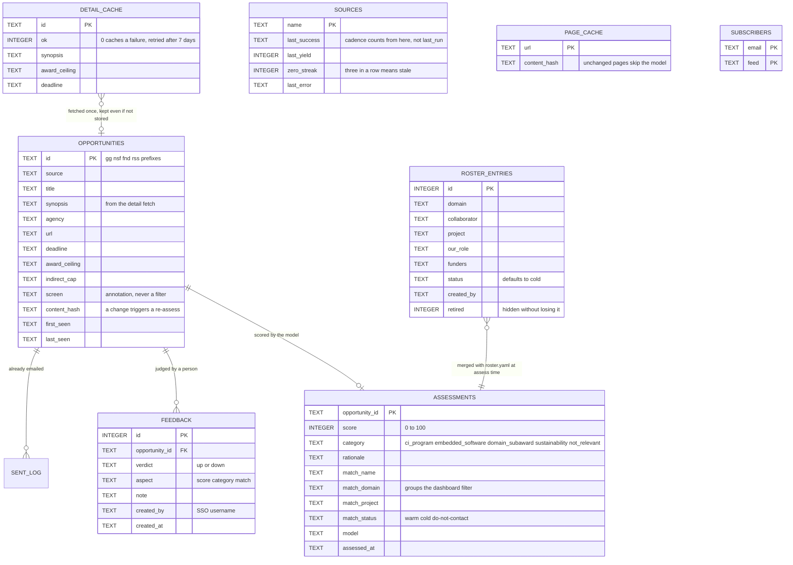
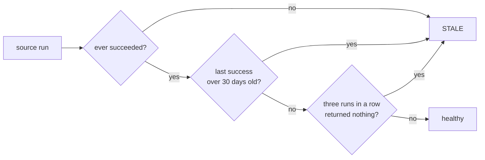

# Grant Sift

Funding signal for a research software group. It reads Grants.gov, NSF, sixteen
foundation pages and an RSS feed, scores each call for RSE relevance against a
roster of past collaborators, and puts the result in a dashboard and a set of
email digests.

The point is not to find the obvious cyberinfrastructure calls. Everyone sees
those, which is why they are crowded. It is to find the domain solicitation
with a software or data-management requirement buried inside it, where a PI
will need a partner and does not yet know it.

## Setup

```bash
pip install -r requirements.txt
cp .env.example .env          # then add your Lumen project key
cp config/roster.example.yaml config/roster.yaml   # fill in real collaborations (gitignored)
set -a; source .env; set +a

python run.py daily           # ingest, assess, export, digest
python run.py serve           # dashboard on http://127.0.0.1:8080
```

The gateway defaults to NCSA Lumen with `gemma-4-31b-it`, so the key is the
only required secret. Override `GRANT_SIFT_LLM_BASE_URL` for any other
OpenAI-compatible gateway.

`config/roster.yaml` is **not in git** — it names real collaborators and
relationship status. Only `config/roster.example.yaml` is tracked. Copy it,
edit it, and keep it local (or mount it in Kubernetes as a ConfigMap). If this
repo was ever public or shared with the real roster committed, scrub history
before relying on “gitignored now” — old commits still contain it.

## Commands

```bash
python run.py daily [--limit N]     # the cron job, assesses N records (default 400)
python run.py ingest                # fetch, enrich, store
python run.py assess [--limit N]    # score anything unassessed, live calls first
python run.py assess --rematch      # clear no-match assessments first, after a roster addition
python run.py export                # write web/opportunities.json
python run.py status                # what ran, what has gone stale
python run.py serve [--host --port] # dashboard, feedback and chat
python run.py digest --feed closing-soon --send
python run.py feedback gg:349021 down "student training grant, not for us"
```

Nightly, via `scripts/daily.sh`, which loads `.env` and refuses to overlap
itself:

```
0 6 * * *  /srv/grant-sift/scripts/daily.sh >> /srv/grant-sift/run.log 2>&1
```

## How it works

```mermaid
flowchart TD
    A1["Grants.gov search2<br/>31 query terms"] --> E
    A2["NSF funding search"] --> E
    A3["RSS feed"] --> SC
    A4["16 foundation pages<br/>stripped to text"] --> X
    X["EXTRACT<br/>model lists the open calls"] --> SC
    E["ENRICH<br/>per-call detail fetch:<br/>description, award, deadline"] --> SC
    SC["SCREEN<br/>annotates only.<br/>Discards nothing"] --> S[("SQLite")]
    S --> AS["ASSESS<br/>one call per record:<br/>score, category, roster match"]
    R1["config/roster.yaml<br/>reviewed baseline"] --> AS
    R2["roster_entries<br/>added in the dashboard"] --> AS
    AS --> S
    S --> J["web/opportunities.json"] --> D["dashboard"]
    S --> G["five email digests"]
    D --> F["FEEDBACK<br/>what was wrong:<br/>score, category or match"]
    F --> S
    F -.->|"next run"| AS
```



Two properties worth preserving:

**The model runs offline, never in a request path.** The dashboard reads a
static file, so nothing user-facing depends on the gateway being up. The chat
proxy is the single exception, and it degrades to a disabled button.

**Nothing is discovered by following links.** Sources come from
`config/sources.yaml` and nowhere else. That is the difference between a tool
you maintain in an afternoon and a crawler you maintain forever.

## Nothing fetched is thrown away

Every record from every source is stored. Relevance is decided by the model
against the roster, because that is the only judgement here with any context.

`config/prefilter.yaml` therefore annotates rather than filters: its keywords,
allowlist and exclusion patterns write a note into `opportunities.screen` and
nothing acts on it. That is queryable, so you can ask what a filter would have
cost you:

```sql
SELECT title, screen FROM opportunities WHERE screen LIKE '%matched exclusion%';
```

The first run after this change showed the old SBIR pattern would have
discarded "NIEHS Worker Training Program's SBIR E-Learning" and one titled
simply "Sociology". The keyword gate had been cutting 1,041 records to 597.

Closed calls are kept and marked, and queue behind live ones in `assess`.
Pruning is off unless `GRANT_SIFT_PRUNE_DAYS` is set.

## Enrichment, and why it comes before the screen

Grants.gov's search endpoint returns only title, agency and dates. Filtering on
that means judging a thousand records a day by their titles.

So each opportunity gets one detail fetch first. That stays cheap because of a
ledger: `detail_cache` remembers every id already fetched, **including ones no
longer stored**, which would otherwise be re-fetched every morning. Measured:
title-only screening stored 118 records; description screening stored 597, all
with a synopsis and 373 with an award figure. The first pass is about 1,150
fetches and five minutes; steady state is only new postings.

Expiry is checked twice, on the search response and again after enrichment,
because the detail endpoint often supplies a deadline the search omitted that
has already passed.

## Feedback

A thumb alone conflates three different judgements, so the dashboard asks which
of them was wrong: the **score**, the **category**, or the **named
collaborator**. Three things then happen, on three timescales:

1. **Now, with no model call.** The verdict is authoritative, so a "not for us"
   drops the call out of the digests immediately. A reviewer outranks a score.
2. **Tonight.** The record's assessment is cleared and re-scored on the next
   run. Re-scoring it synchronously would be near-tautological: the correction
   is already in the prompt telling the model what to conclude.
3. **From then on.** The correction becomes a calibration example for *other*
   records, which is where the value actually is.

Example selection is deduplicated per opportunity, so one heavily rated call
cannot crowd out the rest; ordered by how far apart the model and reviewer were
rather than by recency; and includes a few confirmations, because agreement
used to be discarded, which made most clicks no-ops.

## Roster: baseline plus additions

`config/roster.yaml` is the reviewed baseline and is **gitignored** (only
`config/roster.example.yaml` is tracked). Entries added in the dashboard go to
the `roster_entries` table and are **never written back to that file**.

The two are merged at assessment time, so the model sees one roster. Dashboard
entries default to `cold`, since nothing typed into a form has been reviewed.

A new entry cannot retroactively match calls already scored. `assess --rematch`
clears assessments that matched nobody, which is the cheap subset worth
redoing.

The roster is **trusted context in every prompt**, more so than a feedback
note, and it is already most of each prompt's input. Keep the real file off
git, and keep the deployed app off the open internet.

## Auth

This app performs no OIDC flow. It expects to sit behind something that already
did: oauth2-proxy, mod_auth_openidc, or an ingress that validates the Keycloak
token and passes the result down as headers.

```bash
GRANT_SIFT_AUTH=off                     # default, local development
GRANT_SIFT_AUTH=proxy                   # trust identity headers
GRANT_SIFT_TRUSTED_PROXIES=10.0.0.5     # required, or the headers are refused
GRANT_SIFT_AUTH_REQUIRED_GROUP=grant-sift-users   # optional Keycloak group gate
```

Those headers are only as trustworthy as the network path, so proxy mode
**refuses them unless the request comes from a trusted address**, and the app
must be unreachable except through the proxy. Writes are attributed to the
username, which is what makes weighting feedback by reviewer possible later.
`GRANT_SIFT_AUTH=oidc` fails loudly rather than pretending.

## Chat (“Ask about this call”)

Each ask is a proxied Lumen `/chat/completions` call with the viewer’s own key
(Personalize panel → `sessionStorage`). The server never stores the key or the
transcript; the browser holds the conversation for that tab only (copy/export
to keep it). Lumen has no CORS, so the browser cannot call it directly.

**What the model sees.** Every turn builds a system message from that
opportunity’s stored row — title, funder, deadline, award, URL, pipeline score
and rationale, closest roster match, and the captured synopsis (up to ~8k
chars) — then appends the chat turns. It does **not** re-fetch the live
solicitation. Answers that need the full PDF should say so and point at the
dashboard link.

`base_url` must be https and on `GRANT_SIFT_CHAT_ALLOWED_HOSTS` (exact host or
`.suffix` like `.openai.azure.com`). Defaults cover Lumen, OpenAI, OpenRouter
(Claude etc.), Gemini’s OpenAI bridge, Groq, Fireworks, Together, DeepSeek,
Mistral, and Azure OpenAI. The proxy speaks **OpenAI-compatible**
`/chat/completions` only — use OpenRouter (or similar) for Claude, not the
native Anthropic Messages API. The process
still emits uvicorn access lines (path only; `GRANT_SIFT_ACCESS_LOG=off` to
silence) and in-memory rate-limit counters. Behind Keycloak the chat is private
rather than anonymous.

## Data model

One SQLite file. WAL, with a 30 second busy timeout, so the web app can write
while the nightly job runs.



`assessments` holds one row per opportunity, deleted when the content hash
moves or a reviewer corrects it, which is what queues a re-score.
`detail_cache` and `page_cache` exist only to avoid paying twice. `sources` is
the health table behind the stale banner.

Postgres would only be warranted by many concurrent writers, replication, or
running the app on a different host from the cron job over shared storage,
where SQLite locking is unsafe.

## Failure mode to watch

Not a crash. A source that quietly stops yielding while reporting success.
Three ways to be stale, and the third is the one that hides:



A fresh `last_success` with an empty list looks perfectly healthy; the NSF
adapter had been returning zero records for exactly that reason. Requiring
three consecutive empty runs keeps a quiet week from crying wolf.

Two related traps already fixed: the fetch cadence counts from `last_success`,
not `last_run`, because gating on the attempt let one 404 lock a weekly source
out for a week and silently discard five sources' worth of calls. And a
foundation page returning under 500 characters of stripped text raises instead
of extracting nothing, which catches both a bot wall and a JavaScript-only
shell.

Known: the Wellcome Trust page answers 202 with an empty body from every path.
No URL fixes it. Left in the config so it fails loudly rather than vanishing.

Stale sources appear at the top of every digest, in a dashboard banner, and in
`run.py status`. Do not silence that banner.

## Cost

There is no prompt caching on Lumen, verified: an identical prefix on a repeat
call reports zero cached tokens. So the roster, most of each prompt, is paid
for on every call. Two settings dominate the bill:

**Thinking off** (`GRANT_SIFT_LLM_THINKING=off`, the default). Reasoning is
billed as output and this task does not need it. On glm-5.2 it cut completion
tokens from about 1,350 to 180 with identical scores. It also fixes a real
failure: reasoning counts against `max_tokens`, so at the old budget of 800 the
model spent the whole allowance thinking, returned empty content, and every
record scored 0.

**Model choice**, benchmarked on real records from this pipeline, thinking off,
cost for a full 597-record pass in Lumen coins:

| Model | Scores vs glm-5.2 | Coins |
| --- | --- | --- |
| gemma-4-31b-it | identical | 0.57 |
| deepseek-v4-flash | lower, missed a match | 0.50 |
| nemotron-3-super-120b-a12b | close, slightly generous | 0.63 |
| ornith-1.0-35b | much lower, missed a match | 0.17 |
| glm-5.2 | baseline | 4.10 |

That was three opportunities in one subject area, so treat it as a shortlist.
`ornith` scoring 25 where glm scored 50 would drop a real call below a
threshold, which is how a cheap model costs you a lead.

Dropping the keyword gate entirely took the corpus from 597 to 1,041 records
for about 0.4 coins. Steady state is a few new postings a day, so cents.

If the roster grows past a few hundred entries, the structural fix is to split
assessment: score without the roster, then send the roster only for records
that clear a threshold. At current volumes that is not worth the complexity.

## Tuning

The screen's keyword list is deliberately loose and matching is plain
substring, so short tokens over-match: `api` also matches "rapid" and
"therapies". Two-letter tokens are avoided for that reason.

The query terms in `config/sources.yaml` are the opposite case. Each costs a
separate API request and is capped at the endpoint's row limit, so a term broad
enough to exceed that cap is silently truncated. Keep those specific.

## Deliberately not built

Award feeds, GitHub issue trackers, an API for other services, a vector store,
a job queue, per-user saved filters, and headless-browser rendering for the
handful of pages that need it. Each multiplies the maintenance surface for
little extra signal. Add one only when its absence has actually cost you
something.
